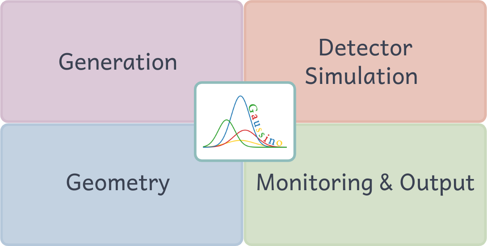
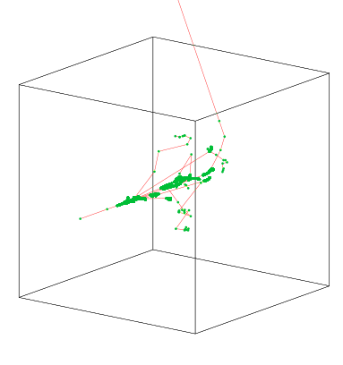
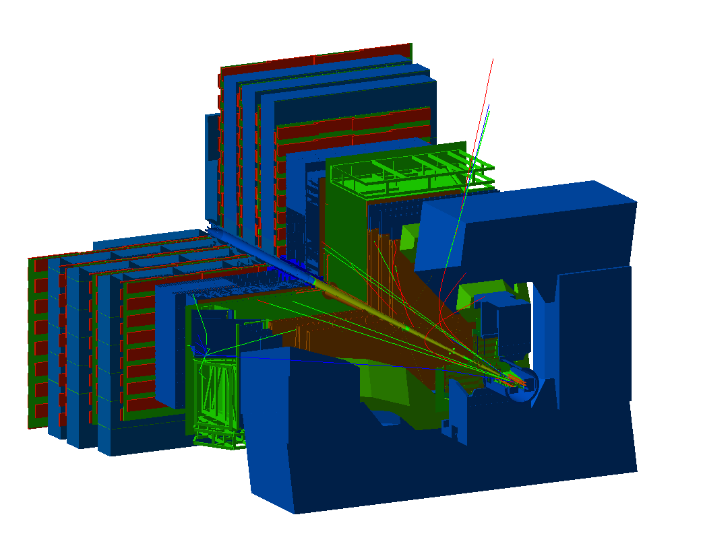

Gaussino
========

Gaussino is a new core simulation framework for high-energy physics experiments. It allows easy prototyping and testing of new technologies. It is a modular framework with 4 main components:

- the generation of events,
- the detector simulation,
- geometry services,
- monitoring and saving of the output.

    Modular structure of Gaussino

Gaussino can be used as the core project for more experiment specific projects or it can be used in a standalone mode. This documentation is devoted only to its standalone mode. Below you will find a list of projects using Gaussino:

- `Gauss-on-Gaussino, the LHCb Simulation framework <https://lhcb-gauss.docs.cern.ch/master/index.html>`_

    Gaussino in a standalone mode

    LHCb detector in Gauss-on-Gaussino

.. toctree::
   :caption: Getting started
   :maxdepth: 2

   getting_started/installation.md
   getting_started/first_simulation_job
   getting_started/contributing.md
   getting_started/further_reading.md

.. toctree::
   :caption: Configuration
   :maxdepth: 2

   configuration/gaussino
   configuration/generation
   configuration/simulation
   configuration/geometry

.. toctree::
   :caption: Examples & Tutorials
   :maxdepth: 2

   examples/external_detector
   examples/parallel_geometry
   examples/dd4hep_standalone
   examples/pp
   examples/gdml

Indices and tables
==================

* :ref:`genindex`
* :ref:`modindex`
* :ref:`search`
